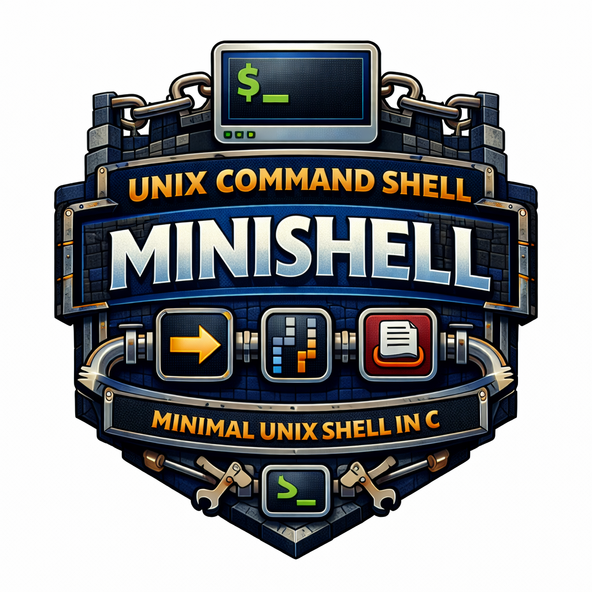

# Unix Command Shell - Minishell

<p align="center">
  
</p>


## Overview
`Minishell` is a small Unix-like shell written in C. It reads user input, tokenizes/parses commands, expands variables, handles redirections/pipes, executes built-ins or external binaries, and manages signals similarly to Bash in interactive mode.

## Core Concepts Covered
- lexer and parser pipeline for shell syntax
- environment variable expansion and quote handling
- process creation and orchestration (`fork`, `execve`, `wait`)
- pipelines and file descriptor redirection (`dup2`, `pipe`, heredoc)
- built-in command implementation (`cd`, `echo`, `env`, `exit`, `export`, `pwd`, `unset`)
- signal handling for interactive terminal behavior

## Project Structure
- `lexer/`: tokenization, grammar checks, variable expansion
- `parser/`: AST/list preparation, redirections, heredoc processing
- `execution/`: command dispatch and external execution flow
- `built_ins/`: shell built-in commands
- `env/`: environment list/array utilities
- `signals/`: signal behavior
- `libft/`: utility library

## Supported Features
- Prompt display
- Command history (up and down arrows)
- System executables available from the environment (ls, cat, grep, etc.)
- Local executables (./minishell)
Builtin commands :
- echo (and option -n)
- cd (with only a relative or absolute path)
- pwd (no options)
- export (no options)
- unset (no options)
- env (no options or arguments)
- exit (with exit number but no other options)
- Pipes | which redirect output from one command to input for the next
Redirections:
- > redirects output
- >> redirects output in append mode
- < redirects input
- << DELIMITER displays a new prompt, reads user input until reaching DELIMITER, redirects user input to command input (does not update history)
Environment variables (i.e. $USER or $VAR) that expand to their values.
- $? expands to the exit status of the most recently executed foreground pipeline.
User keyboard signals:
- ctrl-c displays a new prompt line.
- ctrl-d exits minishell
- ctrl-\ does nothing
However, Minishell does not support \, ;, &&, ||, or wildcards.

## Build
From the project folder:

```bash
make
```

Clean artifacts:

```bash
make clean
make fclean
```

## Run
Start the shell:

```bash
./minishell
```

Quick examples inside the shell:

```bash
echo "hello"
export TEST_VAR=42
echo $TEST_VAR
ls -la | grep .c
cat < infile | wc -l > outfile
```

## Notes
- Readline is required (`-lreadline`).
- Behavior aims to match core Bash semantics for project-required features, not full Bash compatibility.
